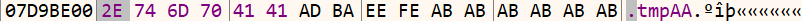

# 问题描述

分析 植物大战僵尸杂交版V2.2 (下载网址： https://pvzgame.net/ ) 的临时目录生成代码

问题来源于 https://space.bilibili.com/21636445/ ，在其电脑上运行程序后出现白屏/花屏/黑屏，且导入 DX 补丁后无效果（但是之前的 2.088 以及2.1 版本在导入补丁后可以运行）。

经他测试给出的解决方案为：( https://www.bilibili.com/video/BV1bhhQeaE7H/ )

1. 利用任务管理器找到 `PlantsVsZombies.exe` 程序；
2. 复制到游戏文件夹内（可能需要导入3D扩展） ；
3. 用复制过来的这个程序来启动游戏。

但这一方法导致不能读写v2.2新更新的迷你游戏的存档，因此在此分析程序临时目录生成代码，期望通过将补丁复制到临时目录中解决问题。

---

# 程序分析

**注意：以下部分的内存地址在不同设备上可能出现变化，因此省略了代码的地址，但整体流程以及最后针对文件的修改应当无误。**

**以下流程仅供参考，如要自行修改请具体情况具体分析。**

## 针对临时目录的分析

考虑到程序在AppData/Temp下生成目录，因此必然需要获取完整路径，该功能在Windows中可以通过GetTempPath相关函数完成。因此使用x96dbg运行程序，在GetTempPath2W处设置断点并运行，当断点命中后运行到用户代码，其前后代码为

| 二进制 | 反汇编 |
| ------ | ------ |
| A1 F0D052 | mov eax,dword ptr ds:[<&GetTempPath2W>] |
| 53        | push ebx                                |
| 56        | push esi                                |
| FFD0      | call eax                                |

其中ebx为缓冲区地址，esi为缓冲区长度。在内存中查看ebx指向位置，在call eax之后该位置内存内容为AppData/Local/Temp/的完整路径

将该指令所在函数运行至返回后可以在内存中发现.tmp开头的字符串（如图，格式为.tmp+6位随机字母数字，这里展示的为全部为A），且在该函数运行前，因此可以猜测该函数即为目录名生成函数。

该函数内部的所有call上设置断点，并依次检查内存中是否存在上述.tmp字符串，其中程序中存在另一常字符串.tmppathPathError，若在某一时刻出现另一处.tmp，即为临时目录名。通过上述方法，可以在同一函数中定位写入.tmp以及后缀的代码。

分析函数内容，可以其中有一处循环，每次循环将会写入一位后缀，语句movzx eax,byte ptr ds:[edx+7514958]中7514958为字符表开头地址，edx为偏移量，对比此处eax中的值和.tmp后新增的字母，可以确认此处功能为生成随机数，并以随机数为索引从字符表中选取字符。

将该处代码修改为 mov eax, 0x41后可以在内存窗口中观察到生成的字符串为.tmpAAAAAA，并可以在Temp目录下找到该文件夹。

经初步实验，该处代码应仅在生成目录中被使用，可以修改。

## 针对创建目录的分析

经过以上流程，可以使程序创建的临时文件夹命名为".tmpAAAAAA"，在测试中发现若改文件夹已存在，程序将会尝试重新生成一个文件名，因此若要使用已有文件夹作为临时文件夹，则需要分析其生成文件夹相关程序。

在Windows中，创建文件夹可以通过CreateDirectory相关函数完成，类似上述流程，对其设置断点并运行，当断点命中后运行到用户代码，其前后代码为

| 二进制 | 反汇编 |
| ------ | ------ |
| 6A 00               | push 0                                 |
| 53                  | push ebx                               |
| FF15 44912600       | call dword ptr ds:[\<CreateDirectoryW\>] |
| 85C0                | test eax,eax                           |
| 74 09               | je pvzhe-launcher.23583A              |

查询微软的文档，当函数成功创建目录时，返回值为非0，若成功创建，则返回值为0。其中目录已存在为一种失败情形，且GetLastError的返回代码为ERROR_ALREADY_EXISTS。这里je在eax为0时候将会跳转到call dword ptr ds:[\<GetLastError\>]，因此可能为为出现错误时的处理代码。

该处跳转代码修改为nop后，程序可以正常运行，且当目录已存在时不会尝试重新生成文件名。

#  程序修改

综上分析，修改的方法为：将生成目录名的代码中的随机数删除，并删去针对目录已存在情形的校验。因此可以在IDA中修改

| 地址           | 修改前                            | 修改后                       |
| -------------- | --------------------------------- | ---------------------------- |
| .text:0047582F | jz      short loc_47583A          | nop                          |
| .text:0044C4F3 | movzx   eax, ds:byte_78C4958[edx] | movzx   eax, ds:byte_78C4958 |

此时程序生成的临时文件夹将会被命名为.tmpAAAAAA，且程序正常运行。

在测试中还发现，程序退出后将会删除临时文件夹，且在Launcher中对RemoveDirectoryA、RemoveDirectoryW、SHFileOperation、SHFileOperationW设置断点均未能命中。因此若要实现将补丁复制到临时目录中解决问题的目标，可以考虑使用脚本进行初始化，具体流程为：

1. 在临时目录中创建目录(mkdir命令，按照上述方法修改后的目录名应为.tmpAAAAAA，需注意开头有个**"."**)；
2. 将需要的补丁复制到目录中(copy命令)；
3. 运行程序。

经过https://space.bilibili.com/21636445/测试，上述修改可以达成目标。

**注意：其中针对movzx   eax, ds:byte_78C4958[edx]的修改中，由于该处的偏移地址将在程序运行时进行计算，因此不应修改为类似mov eax, 41h的指令否则在程序运行时将会在指令上加偏移导致错误，因此若不使用上述方法，可能会需要修改EXE文件头中的内容。**

**注意：在上述修改中不论创建目录是否失败，程序都将认为成功，因此若程序由于其他原因无法创建目录将可能导致不可预料的后果。**

# 声明

该文档仅用于记录本人在逆向时所做的分析和修改，不一定适用于所有情形，该文件仅供学习参考，具体情况请具体分析。

如有发现该文档有任何侵权等问题，可以通过zeyu.wang.0117@outlook.com联系我，我将立刻删除。

任何人都可以下载、查阅、传播该文件，但对于该文档导致的任何问题，本人概不负责，也不保证会回复相关信息。

