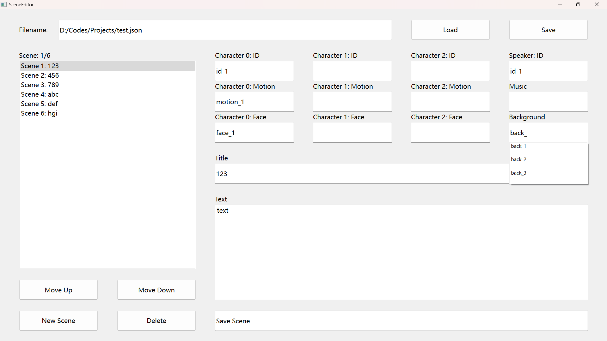
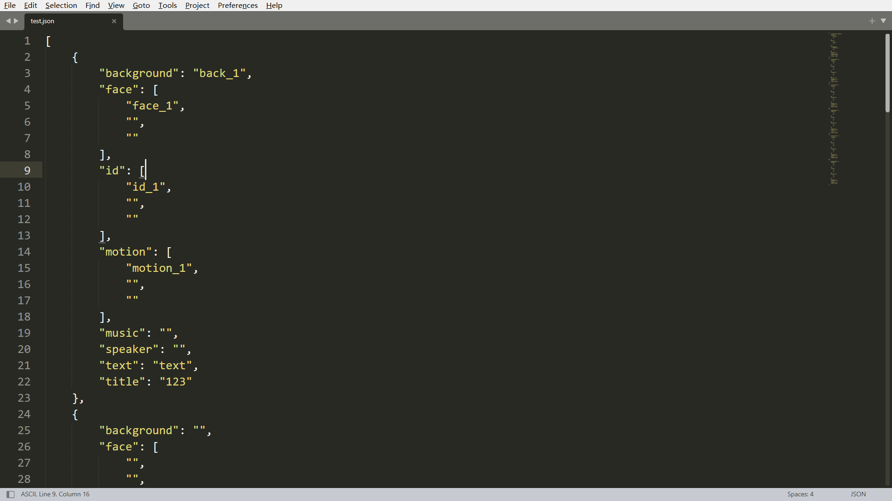

应某位同学要求编写的小工具。具体要求为：编写一个程序方便生成和修改游戏中的对话场景（基于json格式），其中场景包含如下内容：

1. 角色立绘：左、中、右各一人（可以为空），包括角色（id）、动作（motion）、表情（face）三个参数；
2. 对话：说话人（speaker）、标题（title）、文本（text）；
3. 环境：背景图（background）、背景音乐（music）。

实现功能：

1. 将某一段场景向上、向下移动；
2. 新增、删除场景；
3. 保存为json文件、从json文件读取；
4. 自动补全（列表应位于程序目录下，包括id.txt、motion.txt、face.txt、music.txt、background.txt，以行为单位，若文件不存在则自动补全不生效）。

程序界面：

输出的json：

