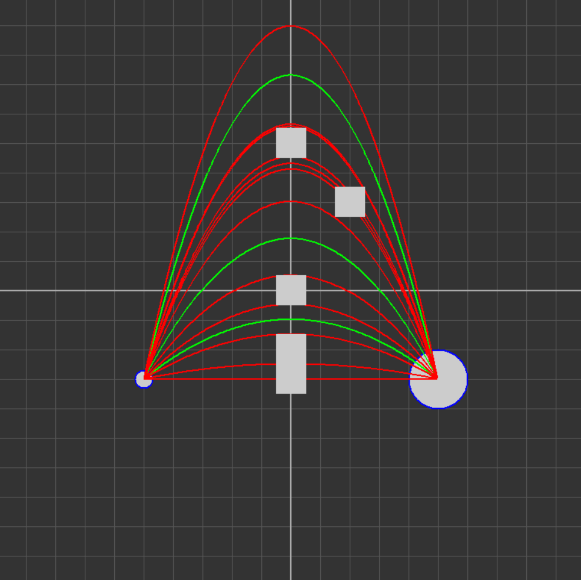

考虑起始点$p_1 = (x_1, y_1)$和目标点$p_2 = (x_2, y_2)$, 则过这两点的抛物线族为
$$
f(x; a, p_1, p_2) = a (x - x_1) (x - x_2) + \frac{x - x_2}{x_1 - x_2} y_1 + \frac{x_1 - x}{x_1 - x_2} y_2.
$$
不失一般性, 下面设$x_1 < x_2$.

**点对点 无爆炸范围 无碰撞体积**

对于任何有界的障碍区域, 一定存在$a_1, a_2$, 使得$f(x; a_1, p_1, p_2)$和$f(x; a_2, p_1, p_2)$恰好从区域上方和下方擦过(程序结果里面的红线), 假设对于区域$I_i, i \in \Omega \subset \mathbb{N}^*$, 存在$(a_1^i, a_2^i)$为满足上述条件的参数, 再考虑抛物线的物理意义($a \geq 0$), 则
$$
\mathbf{A} = \mathbb{R}^+ \setminus \left( \bigcup_{i \in \Omega} (a_1^i, a_2^i) \right)
$$
即为$a$的可行区域(程序结果里面的绿线).

**考虑碰撞体积**

这个比较难搞, 我现在的一个想法是对于可行区域内的每一个区间$(a_1, a_2)$, 取$a = \frac{a_1 + a_2}{2}$, 并进行碰撞检测, 如果取中点过不了的话大概率是不行了. 

当然这显然是一个近似结果, 如果要算得比较漂亮的话或许可以考虑算包络线, 具体方法为: 对于曲线上的任意一点, 求这一点关于曲线的法向量, 并将这一点沿法向量方向移动, 得到包络线上的点. 这个我算了一下, 最后能得到一个参数曲线, 形式非常复杂, 有可能可以用来进行精确判断, 当障碍物都是水平和竖直线的时候可能可以得到一个好结果, 但是我没有继续.

另一个想法是优化: 可以计算所有障碍物到抛物线的最短距离, 并直接用优化算法的方法在每个可行域区间内最大化最短距离, 如果得到的最短距离最大值大于半径说明这个区间内无解. 这个方法可能计算量比较大, 秒级的时间我不知道能不能跑完.

**考虑爆炸范围**

对于上述抛物线族, 当目标点$p_2$由$(x_2, y_2)$移动至$p_3 = (x_2 + u, y_2 + v)$时, $g(x) = f(x; a, p_1, p_2) - f(x; a, p_1, p_3)$为一个一次函数, 且$g(x_1) = 0$, 因此
$$
\forall x \in [x_1, x_2], \vert g(x) \vert \leq \vert g(x_2) \vert,
$$
即两函数之间的距离可以被目标点移动的距离控制, 因此在目标点附近取大小为(小于碰撞体积的二分之一?)的网格时, 有可能可以在某些网格点上计算出可行解(如果有一个可行解的话以这一解为中心, 碰撞体积为半径的范围内的抛物线均为解, 所以网格步长小一点的话大概是能走进去的, 然后可以再类似上面利用优化的方法计算). 

水平初始速度$v$, 竖直初始速度$u$, 初始时刻$t = 0$, 则时刻$t$时
$$
\begin{cases}
u(t) = u - gt,\\ v(t) = v,
\end{cases} \quad
\begin{cases}
x(t) = vt, \\ y(t) = ut - \frac{1}{2} gt^2,
\end{cases}
$$
该程序的目标为解决上述问题，并使用easyx进行可视化，如图，其中方格的变长为$1$，圆形为起始点和终点，红色为恰好过顶点或恰好为直线的极限情形，绿色为极限情形间的可行解。

