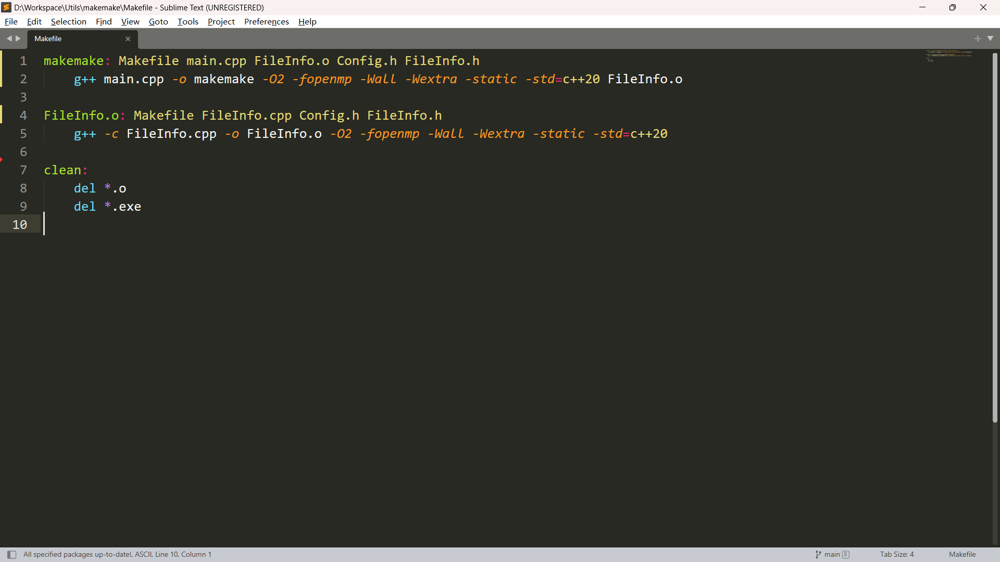

该项目的目标是自动化生成Makefile，具体步骤如下：

1. 通过命令行参数给定源代码目录、主函数所在文件、目标文件名、编译选项；
2. 读取代码文件（包括.c、.cc、.cpp、.cxx、.h、.hh、.hpp、.hxx），并根据文件中的#include指令生成文件关系；
3. 根据文件关系和编译选项生成Makefile。

目录相关函数参考https://blog.csdn.net/qq289665044/article/details/48623325

例：

在该目录下运行makemake后生成的Makefile为：

